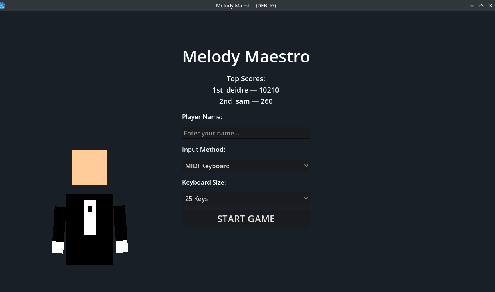
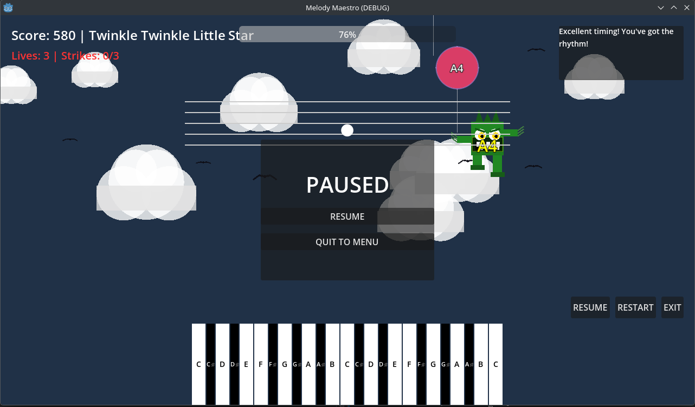

# Melody Maestro

A piano learning game built with Godot 4. Pop balloons and fight monsters by playing the right notes — on a real MIDI keyboard, your computer keyboard, or an acoustic piano picked up by your microphone.

---

## Screenshots

| Start Screen | Gameplay |
|---|---|
|  |  |

---

## Features

### Input Methods
| Method | How it works |
|---|---|
| **MIDI Keyboard** | Plug in any USB/MIDI keyboard and play notes directly |
| **Computer Keyboard** | Use your typing keyboard as a two-octave piano (see layout below) |
| **Microphone (Acoustic)** | Play a real acoustic piano — real-time FFT pitch detection maps your notes automatically |

#### Computer Keyboard Layout
```
Black keys:  W   E       T   Y   U       O   P
            ─── ───     ─── ─── ───     ─── ───
White keys: A   S   D   F   G   H   J   K   L   ;
            C4  D4  E4  F4  G4  A4  B4  C5  D5  E5
```

### Gameplay
- **30 hand-picked songs** across five difficulty tiers: Beginner → Easy → Intermediate → Advanced → Expert → Master
- **Balloon Mode** (early levels) — colourful balloons float down; hit the right note to pop them
- **Monster Mode** (level 19+) — animated monsters march toward you; play the note shown to defeat them
- **Level 30+ Chord Mode** — multi-note chords and intervals generated progressively as difficulty increases
- **3-Life / 3-Strike system** — 3 wrong notes costs a life; lose all 3 and it's game over
- **Groove system** — build a streak of correct notes to unlock drum and bass backing tracks
- **Pause anytime** — press **Escape** or the Pause button; resume or quit to menu from the pause screen
- **Top-3 Leaderboard** — high scores saved locally per player name, top 3 shown on the start screen

### Visuals & Audio
- Animated tuxedo pianist on the start screen with top hat, bow tie, and playing hands
- Quiet background melody plays on the start screen
- Musical staff displays the upcoming note
- Note projectiles fly from keys to pop targets
- Monsters grow more menacing at higher levels (glowing eyes, jitter, size scaling)
- Atmospheric background colour shifts from calm blue-grey to deep crimson as levels progress
- Slime-burst explosion particles when monsters are defeated
- Celebration balloon shower on level clear

---

## How to Play

1. On the start screen enter your name, choose your input method, and select your keyboard size (25 / 49 / 61 / 88 keys)
2. Hit **START GAME**
3. Notes appear on screen — press the matching key before they reach the bottom
4. The musical staff at the top always shows the next note coming
5. Build a streak to unlock groove backing tracks
6. Clear all notes in a song to advance to the next level

### Tips
- Watch the musical staff — it shows what's coming a beat early
- Balloons have the note name printed on them; monsters also show the note in a high-contrast badge
- Pause with **Escape** if you need a breather
- Wrong notes cost strikes — 3 strikes lose a life, so play carefully on higher levels

---

## Difficulty Tiers

| Levels | Tier | Songs include |
|---|---|---|
| 1–5 | Beginner | Mary Had a Little Lamb, Twinkle Twinkle, Hot Cross Buns |
| 6–10 | Easy | Fly Me to the Moon, Jingle Bells, Shape of You, Havana |
| 11–15 | Intermediate | Ode to Joy, Fur Elise, Minuet in G, Greensleeves |
| 16–20 | Advanced | Moonlight Sonata, Turkish March, Canon in D, Spring (Vivaldi) |
| 21–25 | Expert | Imperial March, Super Mario Bros, Tetris Theme, Hedwig's Theme |
| 26–30 | Master | Game of Thrones, Beethoven's 5th, Flight of the Bumblebee |
| 31+ | Endless | Procedurally generated chords and intervals, increasing difficulty |

---

## Building & Running

### Run in Godot Editor
1. Open the project folder in **Godot 4.x**
2. Press **F5** or click the Play button

### Build a Flatpak (Linux)
```bash
flatpak-builder --force-clean build-dir org.melodymaestro.Game.yaml
```

### Requirements
- Godot 4.x
- For MIDI: any class-compliant USB MIDI device
- For Microphone input: a working audio input device and a `Record` audio bus with a Spectrum Analyzer effect configured in the Godot project settings

---

## Project Structure

```
melody-maestro/
├── scenes/
│   ├── main_game.tscn          # Main gameplay scene
│   ├── welcome_screen.tscn     # Start / leaderboard screen
│   ├── balloon.tscn            # Balloon + monster entity
│   └── pianist_character.tscn # Animated start-screen character
├── scripts/
│   ├── game_manager.gd         # Global state, song library, save/load
│   ├── main_game.gd            # Game loop, spawning, scoring, pause
│   ├── balloon.gd              # Balloon & monster drawing/behaviour
│   ├── input_handler.gd        # MIDI, keyboard, and microphone input
│   ├── piano_keyboard.gd       # On-screen piano keyboard UI
│   ├── pianist_character.gd    # Animated tuxedo character (_draw)
│   ├── music_staff.gd          # Musical staff display
│   ├── sound_manager.gd        # Procedural audio engine
│   ├── sky_manager.gd          # Background atmosphere effects
│   ├── note_projectile.gd      # Note-hit projectile animation
│   └── welcome_screen.gd       # Start screen logic + menu music
├── themes/                     # UI theme resources
├── DEV_NOTES.md                # Developer notes and roadmap
└── org.melodymaestro.Game.yaml # Flatpak build manifest
```

---

## Contributing

Pull requests are welcome. Please open an issue first to discuss any significant changes.

---

*Built with Godot 4 · GDScript · No external dependencies*
